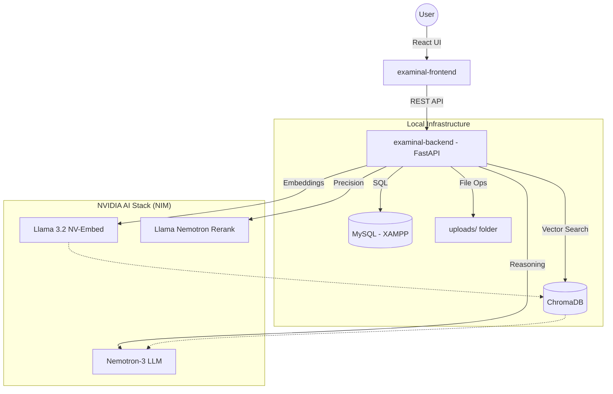

# System Architecture & Data Storage Overview

Examinal uses a multi-layered storage strategy to handle structured application data, unstructured course content, and high-performance AI retrieval.

---

## 1. Data Storage Layers

### A. Relational Data (MySQL / XAMPP)
All structured business logic and user data are stored in the **MySQL** database managed by XAMPP.
- **What's saved here:**
    - **Users:** Profiles, roles (admin, instructor, student), hashed passwords.
    - **Exam Meta:** Titles, durations, passing marks, status (published/draft).
    - **Questions:** Text, options, correct answers, difficulty, and links to source passages.
    - **Grading:** Student answers, scores, and AI-generated feedback.
    - **Logs:** Activity and audit trails.

### B. Vector Storage (ChromaDB)
Course content is "vectorized" to enable AI-powered search.
- **What's saved here:**
    - High-dimensional "embeddings" generated by the **NVIDIA Llama 3.2** model.
    - These vectors allow the system to find the most relevant document sections when generating questions or grading.
    - Stored locally in the `vector_store_data/` directory.

### C. File Storage (Local Filesystem)
The actual documents you upload (PDFs, Docx, etc.) are stored as files.
- **Location:** `uploads/` directory.
- The path and metadata of these files are tracked in the MySQL `content_documents` table.

---

## 2. System Architecture

The following diagram illustrates how the components interact during a typical AI workflow (like Question Generation or Auto-Grading):

---

## 3. How the AI Flow Works (RAG)

1.  **Ingestion:** When you upload a document, the **NVIDIA Embedder** converts the text into numbers (vectors) stored in **ChromaDB**.
2.  **Retrieval:** When generating an exam, the system queries ChromaDB to find the most important facts.
3.  **Reranking:** The **NVIDIA Reranker** filters these facts to ensure the AI only sees the most accurate data.
4.  **Generation:** The **NVIDIA LLM (Nemotron)** reads the filtered facts and writes the questions or grades the answers.
5.  **Final Save:** The result (Questions or Grades) is saved into **MySQL** for permanent access.
